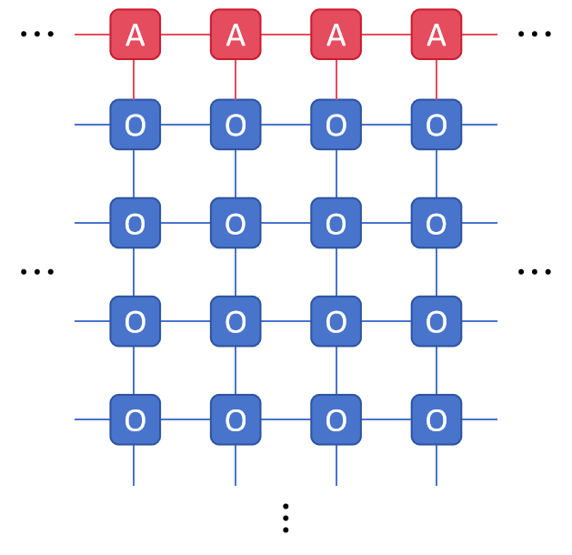
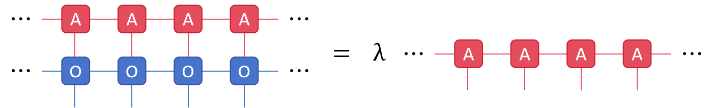
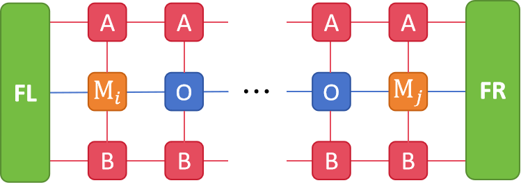

# Knowledge Review

## 1. Tensor Network for Classical Model

### How to transform partition function into tensor network

For any two-dimensional (2D) classical statistical model on a discrete lattice under thermodynamic limit with a Hamiltonian $H$, the partition function

$$
Z = \int\mathrm{e}^{-\beta H} \mathrm{d}\Omega
$$

can always be expressed as the contraction result of an infinite tensor network as follow

Notably, a continuous phase space $\Omega$ requires infinite bond dimensions, so although a classical model with continuous phase space allows for formal transformation into a tensor network, it can not be solved numerically. Here we are actually discussing models like Ising, Clock, and other models whose phase spaces are discrete. For the XY-like model, we need to do one additional discretization.

Now, let us take the 2D classical Ising model as an example to explain how to transform the partition function into a tensor network.

The Hamiltonian of 2D classical Ising model is written as

$$
H = -J\sum_{\langle i,j\rangle} s_i s_j - h\sum_i s_i
$$

where $s_i$ is the spin configuration on site $i$ with discrete values $\{1,-1\}$, and $\langle i,j\rangle$ represents the next neighbor site $i$ and site $j$. The partition function is

$$
\begin{align*}
Z &= \sum_{\{s_i\}}\mathrm{e}^{\beta J\sum_{\langle i,j\rangle} s_is_j + \beta h\sum_i s_i}\\
&= \sum_{\{s_i\}}\left[\prod_{\langle i,j\rangle}\mathrm{e}^{\beta Js_is_j} \prod_{i}\mathrm{e}^{\beta hs_i}\right]\\
&= \prod_i\sum_{\{s_i\}} \left(\mathrm{e}^{\beta hs_i}\prod_\rho \mathrm{e}^{\beta Js_is_{i+\rho}}\right)
\end{align*}
$$

where $\beta = \frac{1}{k_BT}$ is inverse temperature and $\sum_{\{s_i\}}$ represents the sum of all the spin configurations. $\rho$ represents vector between a pair of NN sites. Considering $s_i$ has only two discrete values of $\{1, -1\}$, $\sum_{\{s_i\}}\mathrm{e}^{\beta Js_is_j}$ in the partition function can be viewed as a tranfer matrix $J_{ij}$

$$
J_{ij} = \left(\begin{array}{c c}
\mathrm{e}^{\beta J} & \mathrm{e}^{-\beta J}\\
\mathrm{e}^{-\beta J} & \mathrm{e}^{\beta J}\\
\end{array}\right)
$$

and $\sum_{\{s_i\}}\mathrm{e}^{\beta hs_i}$ can be viewed as a vector $h_i$

$$
h_i = \left(\begin{array}{c}
\mathrm{e}^{\beta h}\\
\mathrm{e}^{-\beta h}\\
\end{array}\right)
$$

Then we can get the tensor network as shown in the figure below, whose contraction result is the partition function of the 2D classical Ising model,

Here $\delta$ is a 5-leg identity tensor.

### How to solve a partition function tensor network

To solve a partition function tensor network, we can consider a variational boundary iMPS at its upper  boundary at infinity as follow

Next, we push the boundary MPS up layer by layer to contract. If we limit its bond dimension to $D$, the boundary iMPS will eventually converge to a fixed point. The fixed point is the solution of the following eigen equation,

where $\lambda$ is the dominant eigenvalue. Such a maximum eigenvalue problem can be solved by `VUMPS` or  `iTEBD` algorithms.

In addition, given the translational symmetry of iMPS, we are actually solving the following equation in the iMPS environment

where $\lambda_i$ is the dominant eigenvalue, which is local partition function as well. The total partition function is the product of all local partition functions, i.e.,

$$
Z=\prod_{i} \lambda_i
$$

### How to compute a 1-site physical quantity

Let us now consider how to compute a 1-site physical quantity expectation. Under the framework of the partition function, the expression of a 1-site physical quantity expectation $\langle M_i\rangle$ is

$$
\langle M_i\rangle = \frac{1}{Z}\int M_i\mathrm{e}^{-\beta H} \mathrm{d}\Omega
$$

The part $\int M_i\mathrm{e}^{-\beta H}\mathrm{d}\Omega$ can also be expressed as the contraction result of an infinite tensor network with an impurity tensor

We can consider introducing variational iMPS at each of the upper and lower boundaries at infinity and contract layer-by-layer. Eventually we will get a one-dimensional quantum channel network

This can be solved by introducing variational environment tensors at the left and right boundaries at infinity

where $\lambda_i$ is also the dominant eigenvalue, which is local partition function as well.

### How to compute a 2-site correlation function

The 2-site correlation function is similar to the 1-site physical quantity. The expression of $F(r) = \langle M_iM_{i+r}\rangle$ is

$$
\langle M_iM_{i+r}\rangle = \frac{1}{Z}\int M_iM_{i+r}\mathrm{e}^{-\beta H} \mathrm{d}\Omega
$$

The part $\int M_iM_{i+r}\mathrm{e}^{-\beta H}\mathrm{d}\Omega$ can also be expressed as the contraction result of an infinite tensor network with two impurity tensors

which can also be mapped to a one-dimensional quantum channel

and be solved by the introduction of environment tensors

### Two generalizations

Both `VUMPS` and `iTEBD` can be easily generalized to the $n$-site case, which allows us to solve the following $n$-site generalization problem

However, due to the exponential growth of the computational cost of the multi-leg environment tensor, the $n\times m$ generalization is only suitable for solving by `iTEBD`, and some approximation needs to be introduced when computing physical quantities and correlation functions

## 2. iMPS with mixed canonical form

Before this section begins, please understand a key concept: **Fixed Point is all we need**.

In infinite tensor method, the behavior of introducing a variational boundary at infinity always corresponds to a maximum eigenvalue problem, which can be described by either a largest eigenvalue equation or a fixed point equation, the solution is usually the same for both in the cases we discuss.

`iMPSForClassicalModels.jl` provides a simple iterator (see `SimpleIteration`) for solving fixed point equations and use `KrylovKit.ArnoldiIterator` or `KrylovKit.LanczosIterator` for solving the maximum magnitude eigenequation.

### What is mixed canonical form

In the previous section, we show how the partition function of a 2D classical model can be represented as tensor network structure and introduce variational iMPS at the infinity boundary. Such a boundary iMPS has a uniform form, which means that every local tensor $A$ (or $n$-site unit cell $[A_1,A_2,\cdots,A_n]$) is the same.

Although the state is uniquely defined by the tensor $A$, the converse is not true, as different tensors can give rise to the same physical state. This can be easily seen by noting that the *gauge transform*

As is well known from DMRG and other MPS algorithms on finite chains, the use of canonical forms helps to ensure the numerical stability of the resulting algorithms, and this extends to algorithms for infinite systems discussed below. First, we can always find a representation of $|\Psi(A)\rangle$ in terms of a new MPS tensor $A_L$

such that the MPS tensor obeys the following condition

The representation of an MPS in terms of a tensor $A_L$ is called the *left-orthonormal* form. This gauge condition still leaves room for unitary gauge transformations,

Similarly, a *right-orthonormal* form $A_R$ can be found such that

These left- and right-orthonormal forms now allow us to define a mixed gauge for the uniform MPS. The idea is that we choose one site, the 'center site', bring all tensors to the left in the left-orthonormal form, all the tensors to the right in the right-orthonormal form, and define a new tensor $A_C$ on the center site. Diagrammatically, we obtain the following form

This mixed gauge form has an intuitive interpretation. First of all, we introduce a new tensor $C=LR$, which implements the gauge transform that maps the left-orthonormal tensor into the right-orthonromal one, and which defines the center-site tensor $A_C$:

This allows us to rewrite the MPS with only the $C$ tensor on a virtual leg, linking the left- and right orthonormal tensors,

The normalization condition $\langle\Psi(A)|\Psi(A)\rangle = 1$ is expressed as $\text{Tr}(CC^\dagger) = \text{Tr}(C^\dagger C) = 1$

In a next step, the tensor $C$ is brought into diagonal form by performing a singular-value decomposition $C=USV^\dagger$, and taking up $U$ and $V^\dagger$ in a new definition of $A_L$ and $A_R$ - remember that we still had the freedom of unitary gauge transformations on the left- and right-canonical form:

The mixed canonical form can also be generalized to the $n$-site case, here we take 2-site as an example:

with left- and right-orthonromal properties

For the sake of both generality and simplicity, we'll keep analyzing the 2-site case below.

### How to find mixed canonical form

Next we show how to find mixed canonical form of uniform MPS. It is not difficult to see that we actually need to find the following fixed point equations

and center bond matrices are $C_{12} = L_{12}R_{12}$ and $C_{21} = L_{21}R_{21}$ with normalization condition $\text{Tr}(C_{12}C^\dagger_{12}) = \text{Tr}(C_{21}C_{21}^\dagger) = 1$. Here, we use an iterative method to solve the following fixed point equations by an Arnoldi eigensolver

Eventually we get fixed point tensors $A_{1L}$, $A_{2L}$, $L_{12}$, $L_{21}$, $A_{1R}$, $A_{2R}$, $R_{12}$, $R_{21}$, and center bond and center tensors are $C_{12} = L_{12}R_{12}$, $C_{21} = L_{21}R_{21}$, $A_{1C} = L_{21}A_1R_{12}$, $A_{2C} = L_{12}A_2R_{21}$

### Optimal approximation based on tangent space

### Overlap with variational optimization

### Variational Infinite Time Evolving Block Decimation (ViTEBD)

### Variational Uniform Matrix Product State (VUMPS)
