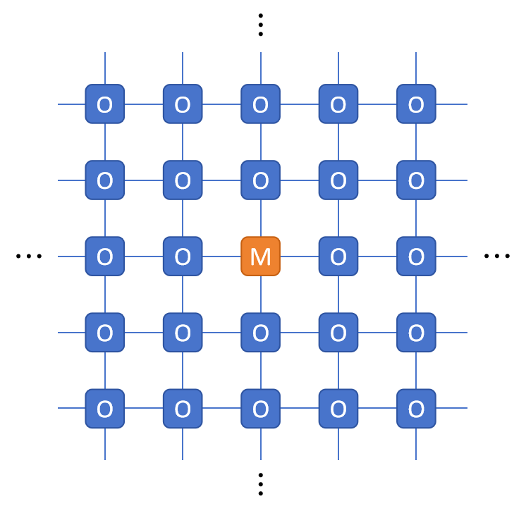
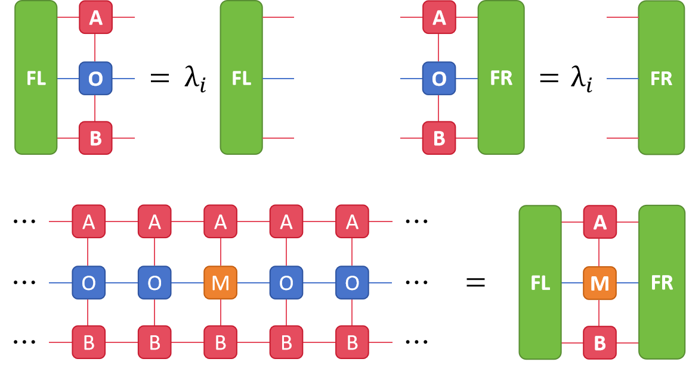
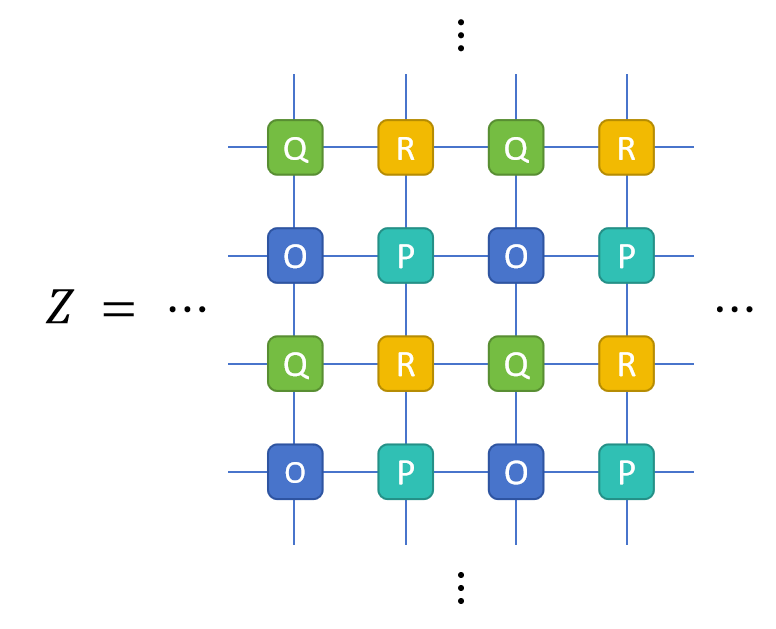

# Tutorial

## 0. Tensor Network for Classical Model

### How to solve a partition function tensor network

For any two-dimensional discrete classical statistical model under thermodynamic limit with a Hamiltonian $H$, the partition function

$$
Z = \int\mathrm{e}^{-\beta H} \mathrm{d}\Omega
$$

can always be expressed as the contraction result of an infinite tensor network as follow

(Notably, a continuous phase space $\Omega$ requires infinite bond dimensions, so although it also allows for formal transformation into a tensor network, it can not be solved numerically. Here we are actually discussing models like Ising, Clock, and other models whose phase spaces are discrete. For the XY-like model, we need to do one additional discretization.)

To solve a partition function tensor network, we can consider a variational boundary iMPS at its lower  boundary at infinity as follow

Next, we push the boundary MPS up layer by layer to contract. If we limit its bond dimension to $D$, the boundary iMPS will eventually converge to a fixed point. The fixed point is the solution of the following eigen equation,

where $\lambda$ is the dominant eigenvalue. Such a maximum eigenvalue problem can be solved by `VUMPS` or  `iTEBD` algorithms.

In addition, given the translational symmetry of iMPS, we are actually solving the following equation in the iMPS environment

where $\lambda_i$ is the dominant eigenvalue, which is local partition function as well. The total partition function is the product of all local partition functions, i.e.,

$$
Z=\prod_{i} \lambda_i
$$

### How to compute a 1-site physical quantity

Let us now consider how to compute a 1-site physical quantity expectation. Under the framework of the partition function, the expression of a 1-site physical quantity expectation $\langle M_i\rangle$ is

$$
\langle M_i\rangle = \frac{1}{Z}\int M_i\mathrm{e}^{-\beta H} \mathrm{d}\Omega
$$

The part $\int M_i\mathrm{e}^{-\beta H}\mathrm{d}\Omega$ can also be expressed as the contraction result of an infinite tensor network with an impurity tensor

We can consider introducing variational iMPS at each of the upper and lower boundaries at infinity and contract layer-by-layer. Eventually we will get a one-dimensional quantum channel network

This can be solved by introducing variational environment tensors at the left and right boundaries at infinity

where $\lambda_i$ is also the dominant eigenvalue, which is local partition function as well.

### How to compute a 2-site correlation function

The 2-site correlation function is similar to the 1-site physical quantity. The expression of $F(r) = \langle M_iM_{i+r}\rangle$ is

$$
\langle M_iM_{i+r}\rangle = \frac{1}{Z}\int M_iM_{i+r}\mathrm{e}^{-\beta H} \mathrm{d}\Omega
$$

The part $\int M_iM_{i+r}\mathrm{e}^{-\beta H}\mathrm{d}\Omega$ can also be expressed as the contraction result of an infinite tensor network with two impurity tensors

which can also be mapped to a one-dimensional quantum channel

and be solved by the introduction of environment tensors

### Two generalizations

Both `VUMPS` and `iTEBD` can be easily generalized to the $n$-site case, which allows us to solve the following $n$-site generalization problem

However, due to the exponential growth of the computational cost of the multi-leg environment tensor, the $n\times m$ generalization is only suitable for solving by `iTEBD`, and some approximation needs to be introduced when computing physical quantities and correlation functions

## 1. Installation

## 2. Model

## 3. Solving Fixed Point

## 4. Observables
